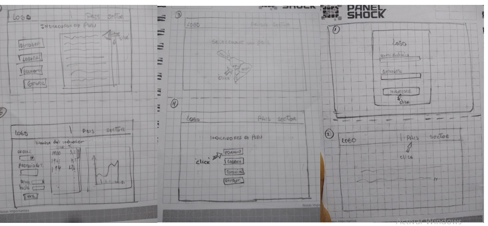
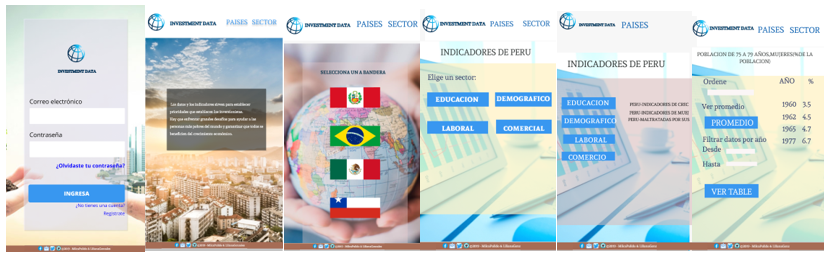
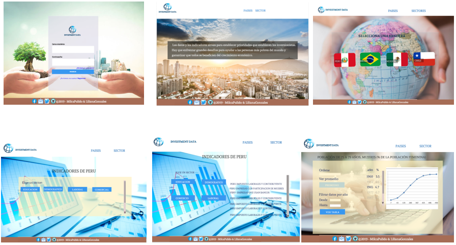

# INVESTMENT DATA

Esta aplicacion contiene indicadores de desarrollo economico, demografico y comercial de los paises: Brasil, Mexico, CHile y Peru. Esta informacion ayuda a tomar decisiones estrategicas que beneficien el interes del usuario. 
Para acceder a la aplicacion se iniciara sesion ingresando su correo electronico y contraseña "laboratoria".

- La imagen final de tu proyecto.

## Investigacion UX 
  ### Usuarios
  - Nuestros usuarios son todas las personas interesadas en el     crecimiento economico de su marca, que tienen un fin lucrativo y no lucrativo entre ellos tenemos a los empresarios, estudiantes, inversionistas, ONGs, profesionales y personas curiosas.
  ### Producto
  - Esta aplicacion te facilita la busqueda de informacion de tu interes, mostrando datos estadisticos de los indicadores seleccionados por pais las cuales son obtenidas a traves de la data del banco mundial por esto la informacion es veras y real. Teniendo esta informacion, como usuario, te ayudará a tomar mejores decisiones la cual te proporciona una ventaja al momento de invertir, e indirectamente ayudaras a disminuir los problemas economicos y sociales que aquejan a ese pais. 

  ### Prototipo de Baja Fidelidad en Desktop
   
   

  - Foto del primer prototipo de baja fidelidad (mobile 
  y desktop) en papel.

   ### Prototipo de Baja Fidelidad en Mobile
   

  - **`Feedback`**: 
    Cuando terminamos el prototipo de baja fidelidad los testeamos con amigos, nos recomendaron agregar algunos estilos para que la pagina sea mas profesional.
    Nos recomendaron trabajar con colores que contrastan mejor con el tema Banco Mundial, tambien poner menos texto en la vista 1(Inicio).  

  - Imagen y link del prototipo de alta fidelidad final (mobile y desktop) en 
  Figma.

 ### Prototipo de Alta Fidelidad en Mobile
 

 ### Prototipo de Alta Fidelidad en Mobile
 

 link de figma: 
 https://www.figma.com/file/ycgdxAYyoWP7yY0pENfyms/bank-mundial?node-id=488%3A0